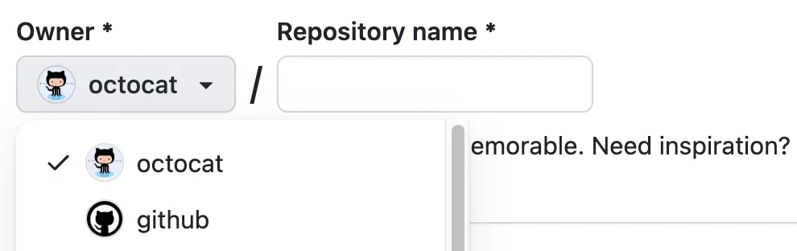
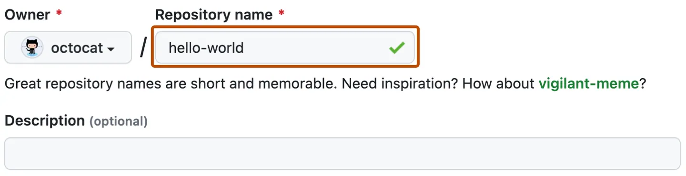

# deploy_react_app_github_pages_vercel

Deploy React app on both GitHub pages and Vercel

## Creating repository from this template

1. Navigate to the main page of the repository.

2. Above the file list, click Use this template.

3. Select Create a new repository.

4. Use the Owner dropdown menu to select the account you want to own the repository.

5. Type a name for your repository, and an optional description.

6. Click Create repository from template.

---

Project has been deployed on

- https://deploy-react-app-github-pages-vercel.vercel.app/

- https://robiulhr.github.io/deploy_react_app_github_pages_vercel/

---

Check the [article](https://robiul.dev//deploy-vite-react-app-on-both-github-pages-and-vercel)
